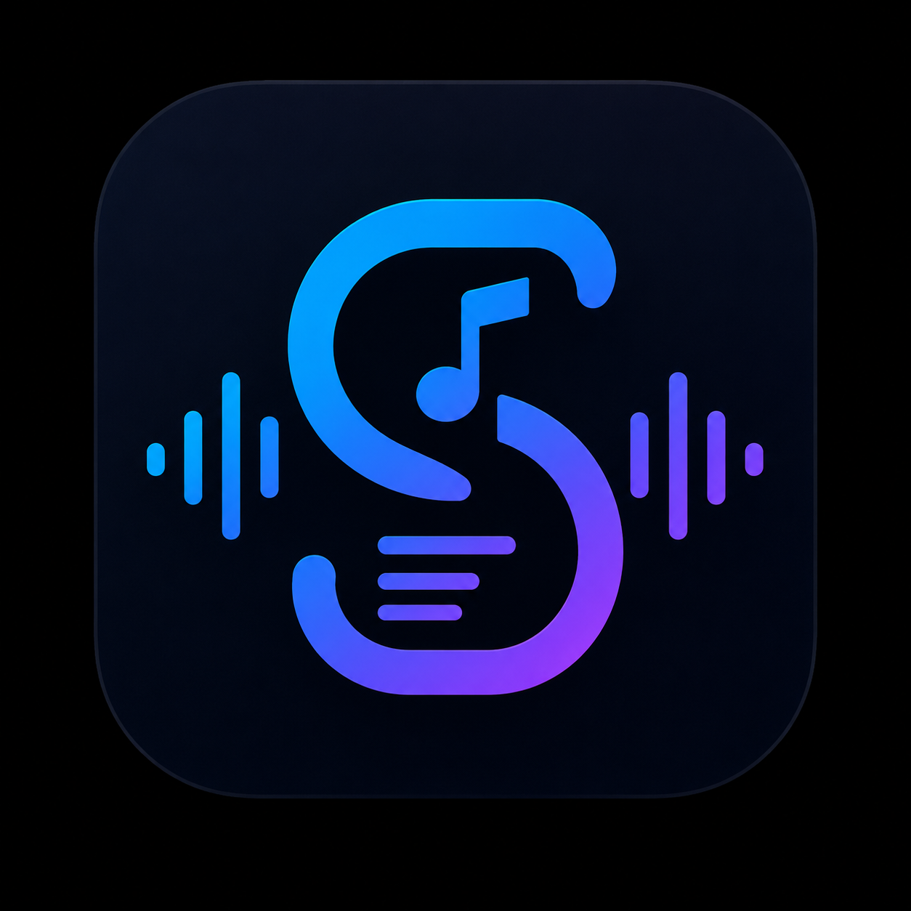

<p align="center">
 
</p>

<h1 align="center">SongScribe</h1>

<p align="center">


</p>

---

## 🎵 Overview

SongScribe is an AI-powered subtitle generation application designed to produce accurate subtitle files for both **music** and **spoken audio**.

Instead of relying entirely on speech transcription, SongScribe intelligently identifies songs using audio fingerprinting and attempts to retrieve **professionally synchronized lyrics** first. Only when synchronized lyrics are unavailable does it fall back to AI transcription.

This hybrid pipeline produces better subtitles while significantly reducing unnecessary transcription work.

---

# ✨ Features

- 🎵 Audio fingerprinting using Chromaprint
- 🔍 Song identification with AcoustID
- 🎼 Metadata retrieval through MusicBrainz
- 📚 Synchronized lyrics via LRCLIB
- 🤖 AI transcription fallback using Faster-Whisper
- 🎬 Generate professional subtitle files
  - TXT
  - SRT
  - VTT
- ⚡ Smart pipeline that prioritizes synchronized lyrics before transcription
- 🌙 Modern React interface
- 📂 Local processing with downloadable outputs

---

# 🏗 Pipeline

```text
                 Upload Audio
                      │
                      ▼
           Generate Fingerprint
                      │
                      ▼
             AcoustID Lookup
                      │
                      ▼
          Retrieve Song Metadata
                      │
                      ▼
               Query LRCLIB
             ┌──────────────┐
             │              │
      Lyrics Found      No Lyrics
             │              │
             ▼              ▼
         Parse LRC     Faster-Whisper
             │              │
             └──────┬───────┘
                    ▼
          Unified Transcript
                    │
                    ▼
            TXT • SRT • VTT
```

---

# ⚙ Tech Stack

## Frontend

- React
- Vite
- Context API
- Axios

## Backend

- Express.js
- Multer
- FFmpeg
- Chromaprint
- AcoustID
- MusicBrainz
- LRCLIB

## AI

- Faster-Whisper
- Python

---

# 📂 Project Structure

```text
SongScribe/

├── frontend/
│   ├── src/
│   ├── public/
│   └── package.json
│
├── backend/
│   ├── providers/
│   ├── routes/
│   ├── services/
│   ├── jobs/
│   └── package.json
│
├── ai/
│
├── branding/
│
└── README.md
```

---

# 🚀 Getting Started

## Clone

```bash
git clone https://github.com/wannabeCODER69/SongScribe.git

cd SongScribe
```

## Backend

```bash
cd backend

npm install

npm start
```

## Frontend

```bash
cd frontend

npm install

npm run dev
```

---

# 🗺 Roadmap

## ✅ Completed

- Modern React + Vite frontend
- Express backend
- Audio upload pipeline
- Audio extraction using FFmpeg
- Song fingerprint generation
- AcoustID integration
- MusicBrainz metadata lookup
- LRCLIB synchronized lyrics retrieval
- TXT export
- SRT export
- VTT export
- Modern dark UI

---

## 🚧 In Progress

- Faster-Whisper transcription pipeline
- Unified transcript generation
- Interactive Viewer
- Click-to-seek playback
- Active subtitle highlighting
- Auto-scroll synchronization

---

## 💡 Future

- Batch processing
- Docker support
- Public hosted demo
- Plugin architecture

---

# 🤝 Contributing

Contributions, suggestions and bug reports are always welcome.

If you have an idea to improve SongScribe, feel free to open an Issue or submit a Pull Request.

---

# 📜 Licensing

Copyright © 2026 Gairik Kairy.

This repository is publicly available for learning, code review, and portfolio demonstration.

You are welcome to explore the source code, learn from the implementation, and suggest improvements.

However, copying, redistributing, modifying, or using substantial portions of this project in another project without prior written permission from the author is **not permitted**.

If you'd like to use any part of SongScribe, please contact the author first.
---

<p align="center">

Made with ❤️ by **Gairik Kairy**

</p>
